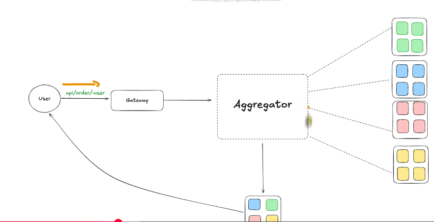
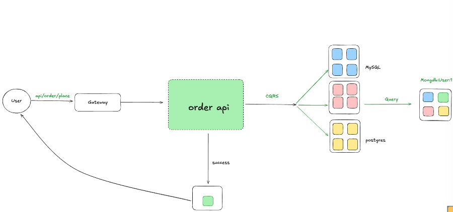
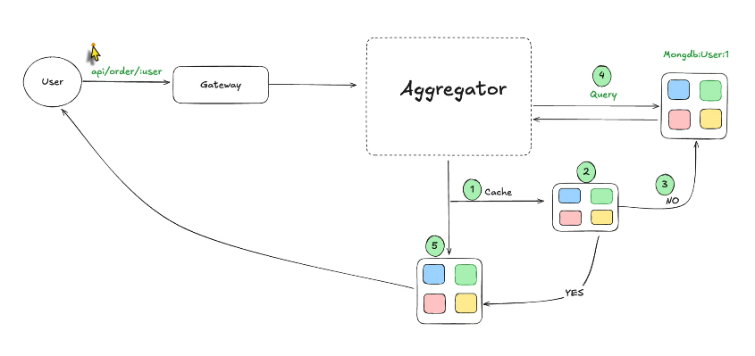

# Bài toán tách từ monolith sang microservice query bị chậm đi thì phải giải quyết như nào

- Giả sử chúng ta có 1 monolith application có 4 service là payment, inventory, order, rewards

- Khi query thì chúng ta chỉ cần thực hiện phép tính join trong db là xong

- Những với microservice thì các kỹ sự hiện nay giải quyết bài toán đó như thế nào

- 2 pattern được nhắc trong vấn đề này đó là:

  - Aggregator pattern
  - Command Query Responsibility Segregation (CQRS)

- Với Aggregator pattern:

- Chúng ta có thể thấy ngay req vẫn sẽ đi qua gateway và đi vào aggregator và có nhiệm vụ truy vấn đến các db và giữ liệu sẽ được tổng hợp lại tại nó và trả lại về cho client. 

    + Ưu điểm: Nó giống như là người điều phối kéo dữ liệu về và user chỉ việc gọi 1 api duy nhất. Và đơn giản phù hợp với DDD
    + Nhược điểm: Giả sử việc kéo dữ liệu từ 4 con DB là song song thì nó sẽ phụ thuộc và thằng chậm nhất và nó gọi nhiều service => độ latency tăng lên và nó có thể bị quá tải nếu như có 1 lượng truy cập lớn (black friday). => nó được sử dụng khi dữ liệu trong microservice không quá nặng

- Với Command Query Responsibility Segregation

- Ta có thể thấy với thao tác ghi vào 1 order nó sẽ push dữ liệu ở 3 con db khác nhau và tổng hợp đưa vào 1 con db để phục vụ cho việc query

- Vấn đề được đặt ra với CQRS giả sử 1 trong 3 con db mà fail thì làm sao khẳng định và đưa về success. Và chúng ta lên đưa về cái trạng thái đơn hàng đang được sử lý thay vì là thành công.

- Ở hình ảnh trên chúng ta hơi thiếu 1 cái đó chính là dữ liệu tổng hợp sẽ được đẩy vào cache

- Và cùng nhau đi đến cuối cùng chúng ta query trong cqrs như thế nào:

- Ta có thể thấy nó vẫn sử dụng aggregator ngay sau thằng gateway và khi query nó sẽ luôn ưu tiên dữ liệu trong cache nếu không có thì nó sẽ query trong db. Và 1 vấn đề mới được đặt ra đó chính là làm sao để đồng bộ dữ liệu giữa cache và db. Câu hỏi sẽ được giải quyết ở những phần sau.