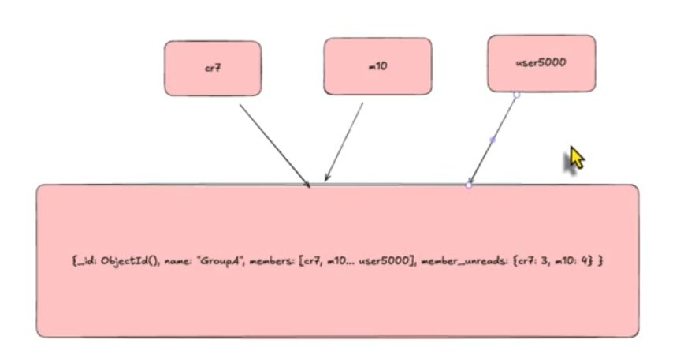

- Phía trên là 1 bad practice giống với bài toán xóa tin nhắn việc 1 document chịu 1 lượng lớn read, update sẽ gây ra vấn đề deadlock, xảy ra tranh chấp require lock
- Bởi vì mongoBD nó lock theo document level tức 1k user đọc 1 group mongo phải serialize write -> tạo bottleneck => group càng đông càng tệ
- 1 document trong mongo có giới hạn

