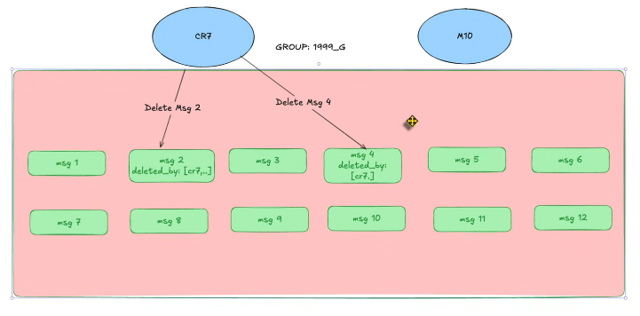

- Xóa tin nhắn có 2 loại đó là xóa phía mình và xóa cả phía đối phương và phía mình

Fresher

Với cách này thì khi query chỉ cần query những tin nhắn mà người query không nằm trong deleted_by là xong
Đúng và vẫn chạy được
<!-- Và 1 đặc điểm khi triển khai chat thì các hệ thống thường sử dụng nosql đặc biệt là mongoDB
Nhưng vấn đề là mỗi document nó giới hạn là 16MB nếu group có nhiều thành viên => dữ liệu bị phình ra và query càng ngày càng chậm

1 Điều nữa đó chính là khi 1 user nó vừa select, update vừa insert thì nó sẽ xảy ra 1 hiện tượng deadlock trong db

khi mà 1 doc nó vừa select vừa update thì cái consistency nó không đúng

ví dụ xóa toàn bộ tin nhắn trong đoạn chat giả dụ 1tr record thì CPU tăng cao vì nó phải loop qua toàn toàn bộ và updateMany -->
Phân tích Nhược điểm (Critical Bottlenecks)
Giới hạn Document Size (16MB Limit):

MongoDB giới hạn 16MB/document. Với các nhóm lớn (100k thành viên), nếu áp dụng logic này (hoặc dùng cho tính năng Read Receipt), mảng deleted_by sẽ phình to không kiểm soát.

Hậu quả: Gây lỗi Write Error, crash ứng dụng.

Hiệu năng "Clear History" (Xóa toàn bộ hội thoại):

Khi user chọn "Xóa lịch sử chat" (giả sử có 1 triệu tin nhắn cũ).

Hệ thống phải quét và update 1 triệu documents để push user vào mảng deleted_by.

Hậu quả: CPU Server tăng vọt (Spike), Disk I/O quá tải, làm chậm cả hệ thống.

Vấn đề Concurrency & Deadlock (Tranh chấp dữ liệu):

Khi 1 document vừa được Select (User B load tin nhắn) vừa được Update (User A xóa tin hoặc update trạng thái), consistency sẽ bị ảnh hưởng.

Việc update hàng loạt (Clear history) sẽ gây Lock trên diện rộng, dẫn đến hiện tượng Deadlock hoặc Timeout cho các request khác.

Senior
Thêm 1 cái table

Nhược điểm nếu collection có nhiều group thì phân chia cái bảng như thế nào