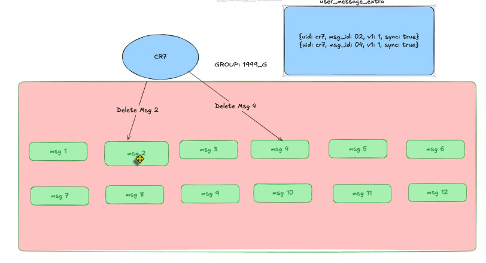

- Xóa tin nhắn có 2 loại đó là xóa phía mình và xóa cả phía đối phương và phía mình

Fresher

Với cách này thì khi query chỉ cần query những tin nhắn mà người query không nằm trong deleted_by là xong
Đúng và vẫn chạy được
Và 1 đặc điểm khi triển khai chat thì các hệ thống thường sử dụng nosql đặc biệt là mongoDB
Nhưng vấn đề là mỗi document nó giới hạn là 16MB nếu group có nhiều thành viên => dữ liệu bị phình ra và query càng ngày càng chậm

1 Điều nữa đó chính là khi 1 user nó vừa select, update vừa insert thì nó sẽ xảy ra 1 hiện tượng deadlock trong db

khi mà 1 doc nó vừa select vừa update thì cái consistency nó không đúng

ví dụ xóa toàn bộ tin nhắn trong đoạn chat giả dụ 1tr record thì CPU tăng cao vì nó phải loop qua toàn toàn bộ và updateMany

Senior
Thêm 1 cái table

Nhược điểm nếu collection có nhiều group thì phân chia cái bảng như thế nào